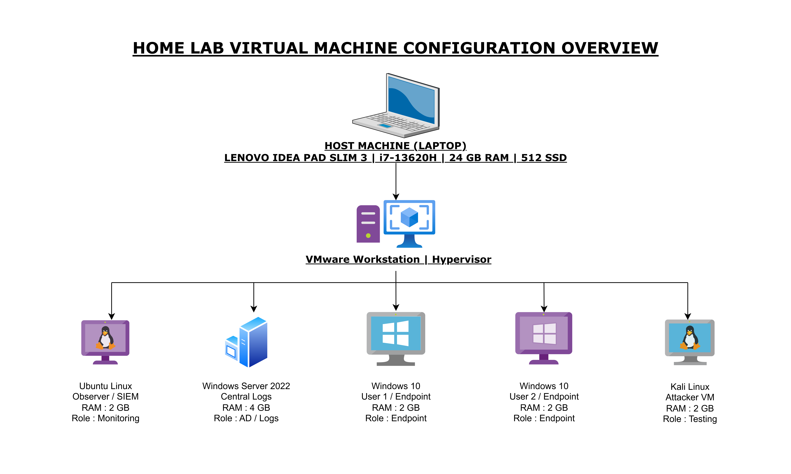
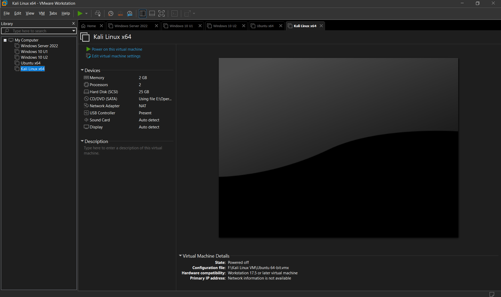
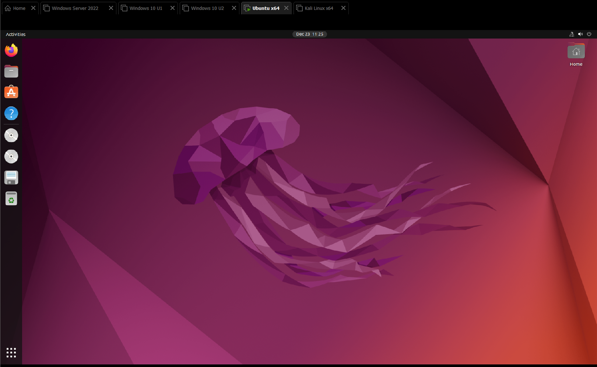
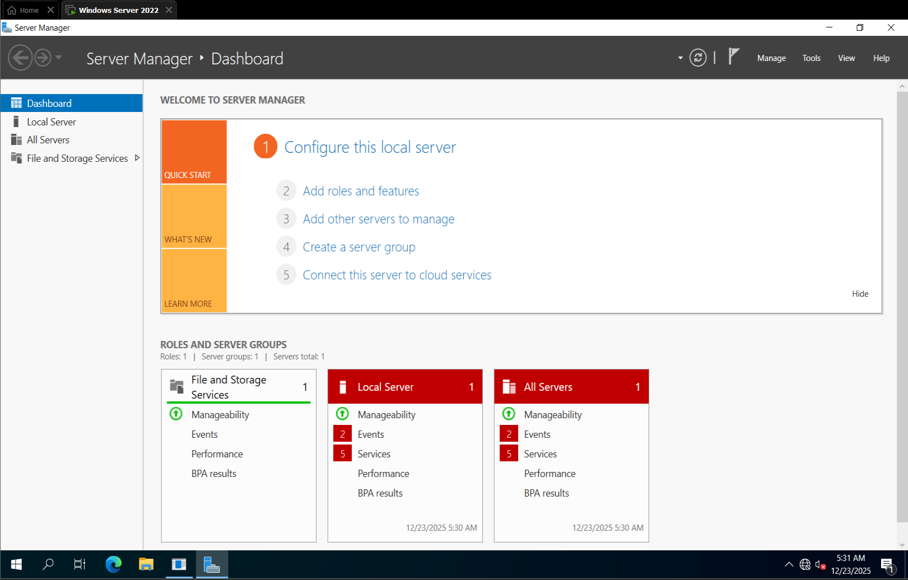
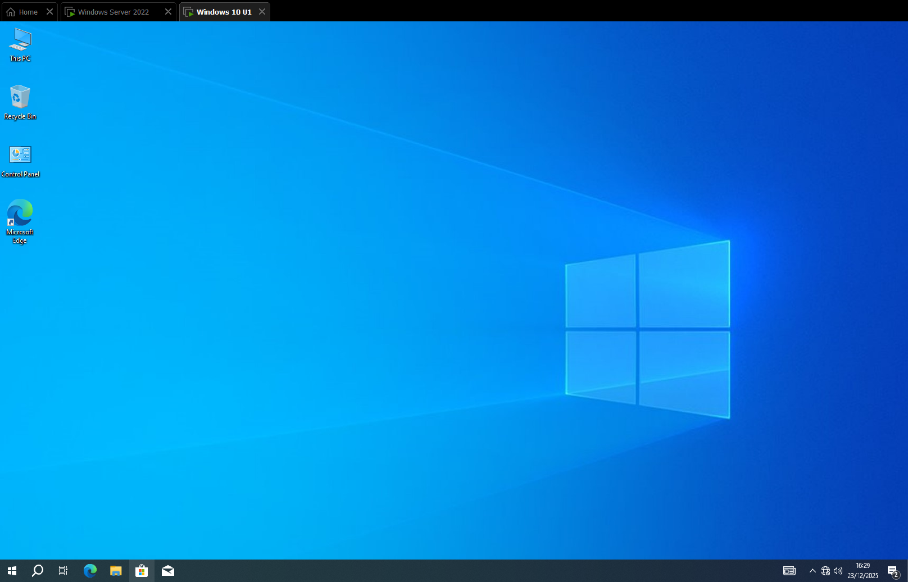
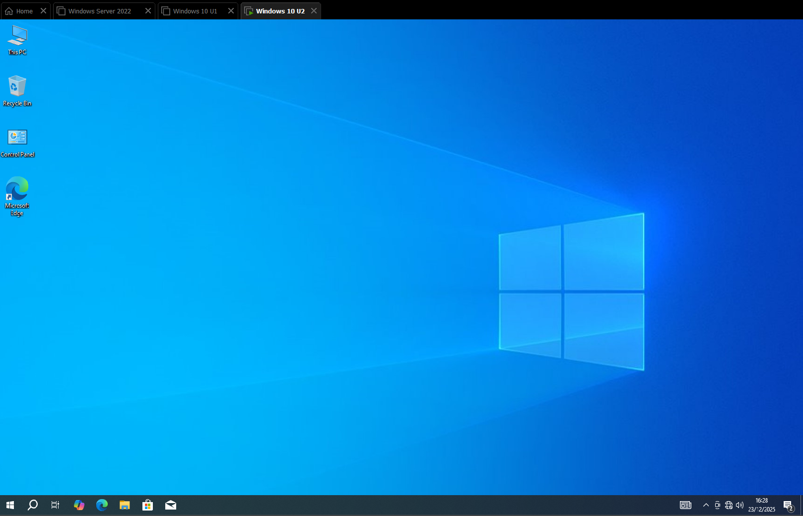
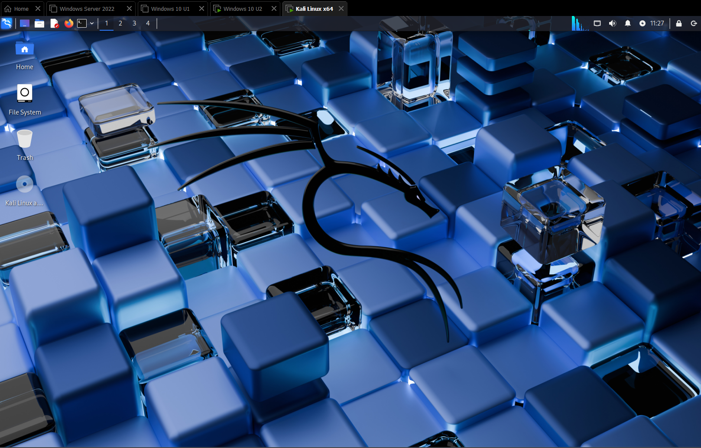

# SOC Lab Intro – Virtual Machine Configuration

##  Purpose
This repository documents the initial setup of my home SOC lab environment.  
The goal is to learn and practice skills required for SOC (Security Operations Center) work, including log analysis, threat detection, and incident response.

---

##  Host Machine Specs
- **Model:** Lenovo IdeaPad Slim 3  
- **Processor:** Intel Core i7-13620H  
- **RAM:** 24 GB  
- **Storage:** 512 GB SSD   

---

##  Hypervisor
- **VMware Workstation**

---

##  Virtual Machines Overview

| VM Name              | OS               | Role(s)               | RAM  |
|---------------------|------------------|------------------------|------|
| Ubuntu Linux        | Linux            | Observer / SIEM       | 2 GB |
| Windows Server 2022 | Windows Server   | AD / Central Logs     | 4 GB |
| Windows 10 – User 1 | Windows 10       | Endpoint              | 2 GB |
| Windows 10 – User 2 | Windows 10       | Endpoint              | 2 GB |
| Kali Linux          | Linux            | Attacker / Testing    | 2 GB |

---

##  Network Design
All VMs are connected through a NAT network.  
- **Windows Server 2022** acts as the Domain Controller.  
- **Windows 10 endpoints** are joined to the domain.  
- **Ubuntu** will be configured as a SIEM/log collector.  
- **Kali Linux** will simulate attacks to generate logs and alerts.

---

##  Diagram

##  Screenshots

### VMware Environment Overview

### Individual Virtual Machines Running
| VM | Screenshot |
|----|------------|
| Ubuntu |  |
| Windows Server 2022 |  |
| Windows 10 – User 1 |  |
| Windows 10 – User 2 |  |
| Kali Linux |  |
